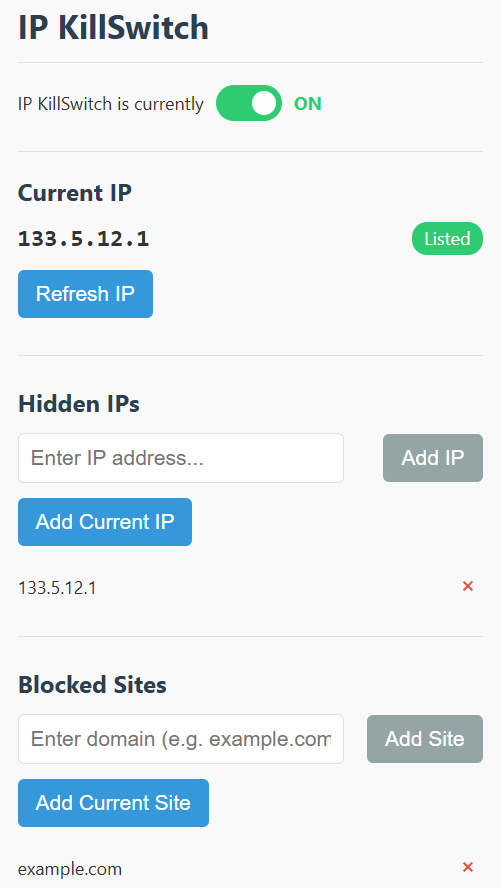
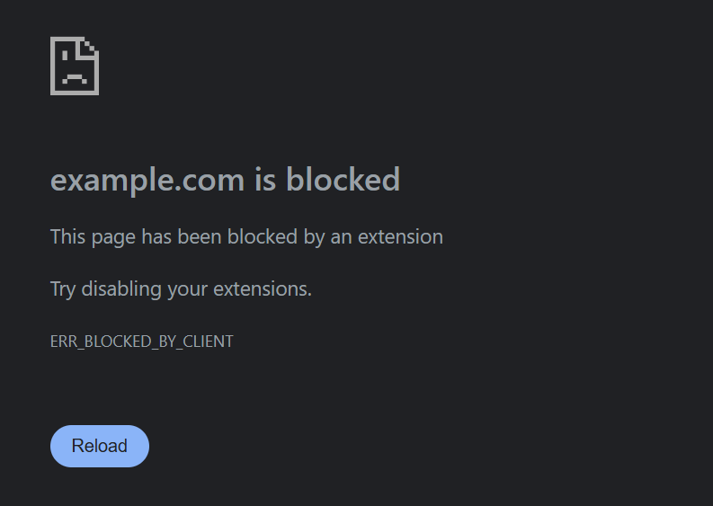

# IP KillSwitch: Protect Your Privacy When VPN Disconnects

## 📌 Introduction
IP KillSwitch is a Chrome extension designed to automatically protect your privacy by blocking access to selected websites when your real IP address is detected. It's particularly useful for users who rely on VPN services and want to prevent accidental exposure of their browsing activity when their VPN connection drops.

## ✨ Features
- **Automatic Website Blocking**: Instantly blocks specified websites when accessed from monitored IP addresses
- **IP Management**: Easily add and remove IPs you want to monitor
- **Website Blacklisting**: Maintain a custom list of websites to block
- **One-Click Controls**: Add your current IP or current website with a single click
- **Real-time IP Detection**: Continuously monitors your current IP address
- **On/Off Toggle**: Temporarily or permanently disable the extension when needed
- **Visual Status Indicators**: Clear visual feedback about your protection status

## 🖼️ Screenshots

### Main Interface

### Website Blocking

## 🛠️ Technology Stack
- **Chrome Extension API**: Core extension functionality
- **Chrome Declarative Net Request API**: Website blocking without requiring broad permissions
- **JavaScript (ES6+)**: Extension logic and user interface
- **HTML5 & CSS3**: User interface structure and styling
- **Chrome Storage API**: Secure storage of user settings

## 🚀 Installation

### From Chrome Web Store (Coming Soon)
1. Visit the IP KillSwitch page on Chrome Web Store
2. Click "Add to Chrome" to install the extension
3. The IP KillSwitch icon will appear in your Chrome toolbar

### Manual Installation (Developer Mode)
1. Download or clone this repository
2. Open Chrome and navigate to `chrome://extensions/`
3. Enable "Developer mode" using the toggle in the top-right corner
4. Click "Load unpacked" and select the `ip-killswitch` directory
5. The extension will be installed and activated

## 📋 How to Use

### Basic Setup
1. Click the IP KillSwitch icon in your Chrome toolbar to open the popup interface
2. The extension will automatically detect and display your current IP address
3. Add this IP to your monitoring list if it's your real (non-VPN) IP address by clicking "Add Current IP"
4. Add websites you want to block by entering domains or clicking "Add Current Site" while visiting them

### Managing IPs
- **Add an IP**: Enter the IP address manually or use "Add Current IP" to add your current IP
- **Remove an IP**: Click the "×" button next to any IP in your monitoring list

### Managing Websites
- **Add a website**: Enter the domain name manually (e.g., example.com) or use "Add Current Site"
- **Remove a website**: Click the "×" button next to any domain in your blocked sites list

### Extension Controls
- **Enable/Disable**: Use the toggle switch to turn IP KillSwitch on or off
- **Temporary Disable**: When turned off, the extension will be disabled for 1 hour
- **Permanent Disable**: Click the "click here" link to disable the extension until manually re-enabled

## 🔒 Privacy
- All of your settings are stored locally in your browser
- No data is sent to external servers except for IP address checks (via ipify.org)
- The extension uses minimal permissions required for its functionality

## 📄 License
This project is licensed under the MIT License - see the LICENSE file for details.

## 👨‍💻 Developer Information
- **Name**: HAN SHIN (韓 信)
- **GitHub**: [hanshindata](https://github.com/hanshindata)
- **Issues & Feedback**: Please report issues through the [GitHub repository](https://github.com/hanshindata/ip-killswitch/issues)
